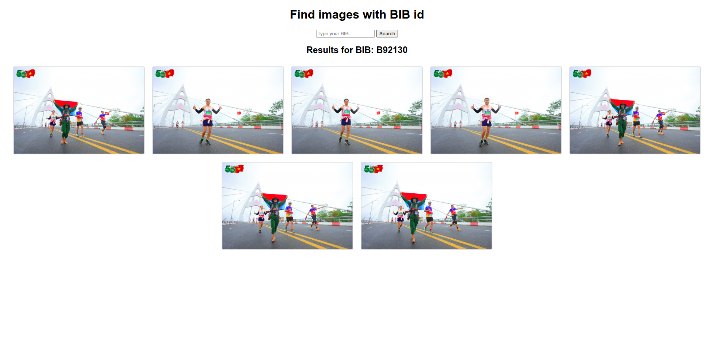

# RunCamFinder
**RunCamFinder** is a project that helps **retrieve and extract images of marathon runners based on their BIB number**.

Images are collected from [https://bibpix.net/](https://bibpix.net/) and are used **strictly for educational and research purposes**, not for any commercial use.

# Installation & Running

> **Requirement**: Please make sure [Anaconda](https://www.anaconda.com/) is installed beforehand.

### 1. Create a virtual environment:
```bash
conda create -n marathon python=3.12
```

### 2. Activate the environment:
```bash
conda activate marathon
```

### 3. Install dependencies:
```bash
pip install -r requirements.txt 
```

### 4. Crawl the images:
```bash
python crawl_images.py
```

### 5. Extract the data:
```bash
python bib_extract.py
```

### 6. Start the app:
```bash
uvicorn main:app --reload --port 8001
```
Then open your browser and go to http://localhost:8001 to start using the app.

# App Preview



